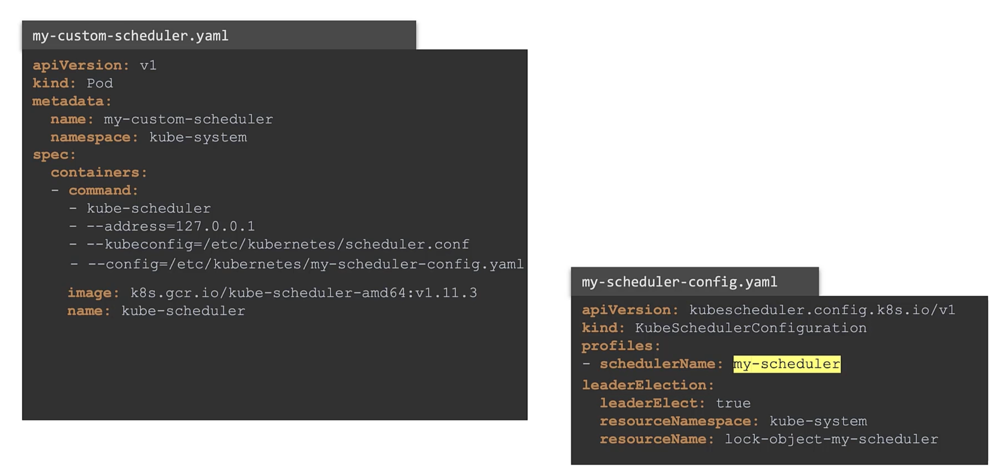

# Multi Scheduling

you  can create your own scheduler with specific criteria. kubernetes cluster is highly extensible.
all the request can go to default scheduler (Name= default-scheduler) but specific request can go to custom scheduler.
 
# Scheduler config yaml file
It should be created in /etc/kubernetes/config
sample name: myScheduler.yml
```bash
apiVersion: kubesechuler.config.k8s.io/v1
kind: KubeSchedulerConfiguration
profiles:
- schedulerName: <scheduler name>
```

# Scheduler Service Config
```bash
ExecuteStart=/usr/local/bin/kube-scheduler \\
  --config=/etc/kubernetes/config/myScheduler.yml
```
**Note:** If you have different masters and you have different scheduling running on each of them you have to specify the LeaderElection as only one scheduler can be active at the same time.


# Get The Logs 
kubectl logs <schedulername> --namespace=kube-system

# Pod definition
```bash
apiVersion: v1
kind: Pod
metadata:
  namespace: <NS-Name> #Optional
  name: <Pod-Name>
  labels:
    <Key>: <Value>
spec:
  containers:
    - name: <Container-Name>
      image: <Image-Name>
      ports:
        - containerPort: <Port>
  schedulename: <Schedule-Name>
```
